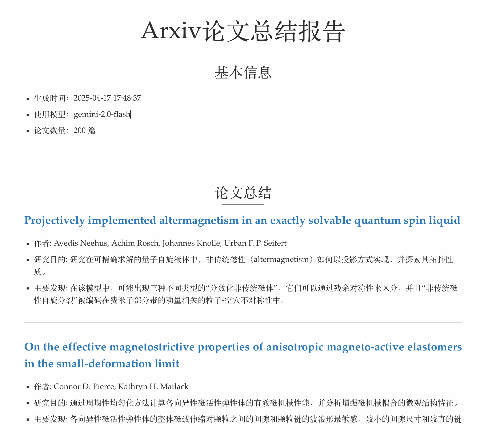

# ArXiv Summary Daily

一个自动获取和总结 arXiv 论文的工具。每天自动检索最新的论文，并使用 AI 生成摘要。

## 功能特点

- 支持利用Github Actions在服务器端定时更新并部署到GitHub Pages
- 支持多个 arXiv 分类的论文检索
- 自动过滤重复论文
- 使用 AI 生成论文摘要
- 支持增量更新，避免重复处理
- 可配置的搜索参数和关键词
- 输出示例



## 配置

在 `config/settings.example.py` 中配置：

- 搜索分类 (CATEGORIES)
- 搜索关键词 (QUERY)
- AI 模型的 API 密钥 (LLM_CONFIG中的api_key参数) - **注意：** 如果使用 GitHub Actions，建议通过 Secrets 配置 API 密钥。
- 其他搜索参数 (SEARCH_CONFIG)
- 输出配置 (OUTPUT_DIR): 设置存放AI summary的文件路径 (本地运行时使用)

## 使用方法 1: GitHub Actions 自动部署 (推荐)

本项目配置了 GitHub Actions 工作流 (`.github/workflows/pages.yml`)，可以实现全自动的论文检索、总结和网站部署。

**工作流程:**

1.  **触发:**
    *   每周一至周五北京时间中午 12:00 自动运行。
    *   或者也可以在Github Actions界面中手动触发。
2.  **执行:**
    *   自动拉取最新代码。
    *   根据 `config/settings.example.py` 中的 `CATEGORIES` 和 `QUERY` 设置（或 Actions 文件中硬编码的参数，如果存在）搜索 arXiv 论文。
    *   使用配置的 AI 模型生成论文摘要。**需要配置 GitHub Secrets `LLM_API_KEY` (见设置步骤)**。
    *   将最新的摘要 Markdown 文件生成为 `index.md`。
    *   使用 Jekyll 将结果部署到 GitHub Pages。

**设置步骤:**

1.  **Fork 本仓库**: 如果你想在自己的 GitHub 账号下运行，请先 Fork 这个仓库。
2.  **配置 Secrets**:
    *   在你的 GitHub 仓库页面，进入 `Settings` -> `Secrets and variables` -> `Actions`。
    *   点击 `New repository secret`。
    *   创建一个名为 `LLM_API_KEY` 的 Secret，其值为你的 AI 模型 API 密钥。工作流将自动读取这个 Secret。
3.  **(可选) 修改配置**:
    *   如果你想更改搜索的分类或关键词，请直接修改仓库中的 `config/settings.example.py` 文件并提交。工作流将使用最新提交的配置。
    *   *注意：* 不要在 `settings.example.py` 中直接写入 API 密钥，应始终使用 GitHub Secrets。
4.  **查看结果**: 工作流运行成功后，生成的论文摘要网站将发布在你的 GitHub Pages 地址 (通常是 `https://<your-username>.github.io/<repository-name>/`)。

## 使用方法 2: 本地运行

### 安装

1. 克隆仓库并进入项目目录：
```bash
git clone https://github.com/dong-zehao/ArxivSummaryDaily.git
cd ArxivSummaryDaily
```

2. 安装依赖：
```bash
pip install -r requirements.txt
```

3. 安装命令行工具：
```bash
pip install -e .
```

安装完成后，`arxivsummary` 命令将被添加到系统路径中，可以在任何目录下直接使用。

### 配置

参考前面的配置方法，这里需要将 `config/settings.example.py` 改名为 `config/settings.py`，以便在其中存储你的api密钥等敏感信息。

### 使用
运行主程序：
```bash
arxivsummary
```

可选参数：
- `--query`: 设置搜索关键词，默认使用配置文件中的 QUERY
- `--categories`: 设置要搜索的 arXiv 分类，可指定多个，默认使用配置文件中的 CATEGORIES
- `--max-results`: 设置要获取的最大论文数量，默认使用配置文件中的设置
- `--output-dir`: 设置输出目录，默认使用配置文件中的 OUTPUT_DIR

使用示例：
- 搜索关键词`nickelate`，只搜索最新的10篇文献
    ```bash
    arxivsummary --query "nickelate" --max-results 10
    ```
- 搜索关键词`cuprate`，在凝聚态-超导或者凝聚态-强关联领域搜索，输出在指定的文件夹中
    ```bash
    arxivsummary --query "cuprate" --categories cond-mat.supr-con cond-mat.str-el --output-dir "./cuprate_summaries"
    ```

## 输出 (本地运行)

- 论文总结保存在 `OUTPUT_DIR/summary_yyyyMMdd_hhmmss.md`

